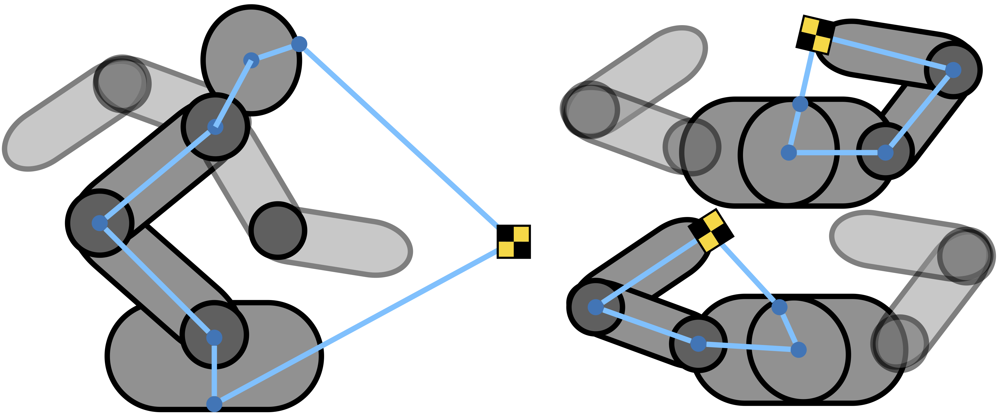
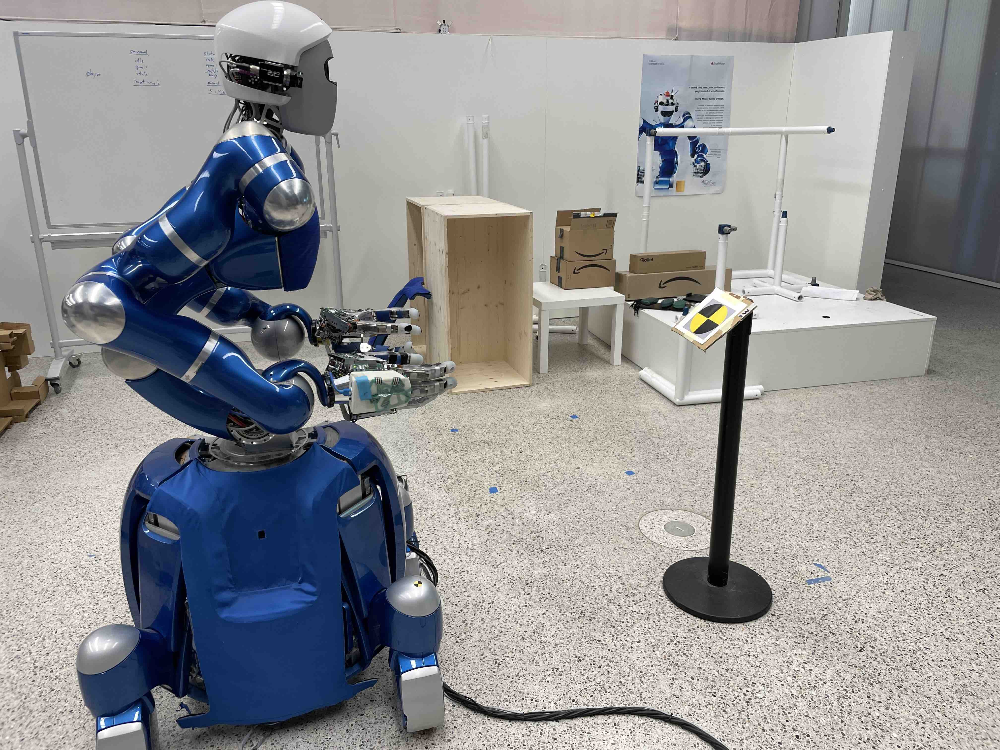

[Click here](../dataset/measurements.csv.zip) to download the dataset.

___

The dataset contains in total \\(N=750\\) measurements of the humanoid robot Agile Justin. 
For each of the three markers, 50 configurations have been selected and for each of these configurations measurements from 5 different head positions 
have been collected.
Each data point consists of a tuple \\( (q, u) \\) with the commanded joint configuration \\(q\\) and the corresponding pixel positions \\(u\\) of the markers in the RGB image.
All the joints are in rad and the positions are provided in pixels.
The measurements were acquired using the internal RGB camera, a 640x480 Kinect.
The marker itself consisted of a black and yellow cross to be well visible in the RGB camera.

{:.this 
style="width: 700px; 
display: block;
margin-left: auto;
margin-right: auto"}
*Sketch of the calibration setup. The robot collects images of markers on both of its hands and a pole in front of it. The blue chains show how forward kinematics plus camera projection close the measurement loop. Even if the arms are not directly involved in the pole measurements, their mass distribution in different positions influences the torso elasticities.*

{:.this
style="width: 700px;
display: block;
margin-left: auto;
margin-right: auto"}
*Real setup with the additional marker on a pole 1.2m in front of the humanoid Agile Justin.*

---

To close the measurement loop we need some additional frames and positions.
Besides the camera frame \\({}^{\mathrm{c}}T_0\\), which is further explained in the [camera section](../_pages/camera.md) ,
the rough position of the three markers on and in front of the robot must be known.
The initial guess of the relative position to the respective robot frames (pole: 0, right: 13, left: 22) are given by: 

$$
\begin{align}
&& {}^{0}x_{\mathrm{M}} =  [1.3, 0.0, 0.32]
&& {}^{13}x_{\mathrm{M}} = [0.03, 0.0, 0.01]
&& {}^{22}x_{\mathrm{M}} = [0.03, 0.0, 0.01]
\end{align} 
$$

Note that the initial frame 0 of the robot is roughly 0.6m above the floor as the description of the torso kinematic starts there. 