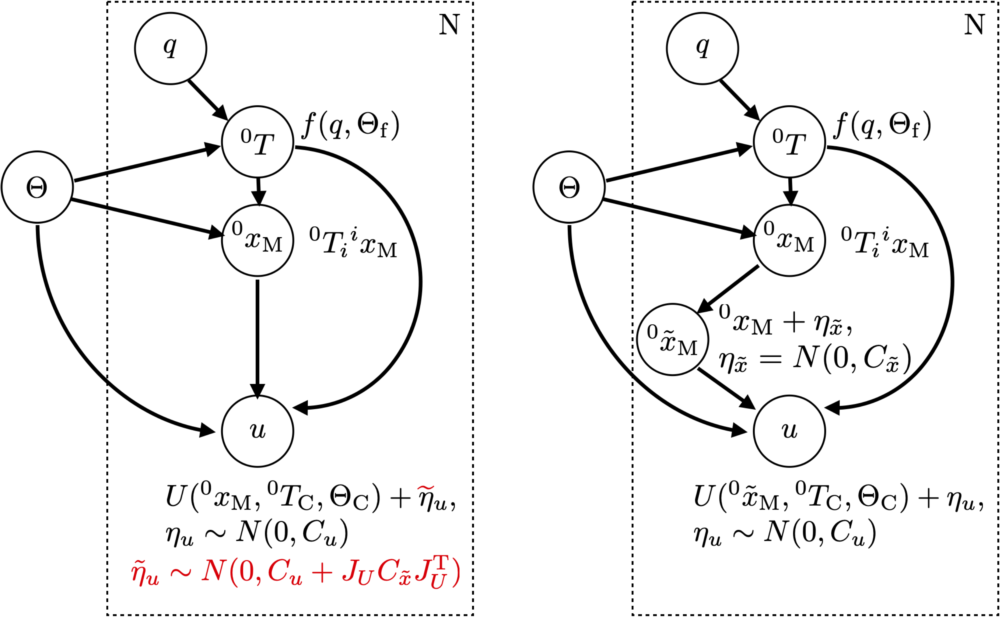

## Virtual Noise

{:.this 
style="width: 600px; 
display: block;
margin-left: auto;
margin-right: auto"}
*Probabilistic graphical model of the calibration problem including the camera and robot model.
For each of the \\(N\\) samples, it describes how the pixel coordinates \\(u\\) of a marker is computed from the joint configuration \\(q\\) and the model parameters \\(\Theta\\).
**Left (w/o red parts)**: Original mapping with the real pixel measurement noise \\(\eta_u\\) as the only source of stochasticity.
**Right**: An additional virtual cartesian noise node is added to compensate for the imperfect (actually deterministic) kinematic model.
**Left (with red parts)**: The virtual noise can be incorporated into the original model, resulting in an effective pixel noise with a \\(\tilde{\sigma}_u\\) depending on the distance of the marker to the camera (\\(\propto 1/z^2\\)).*

---

